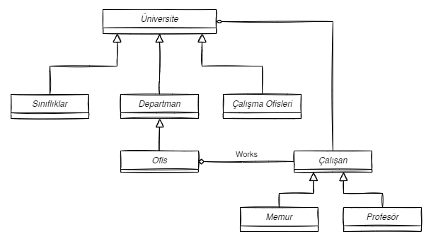
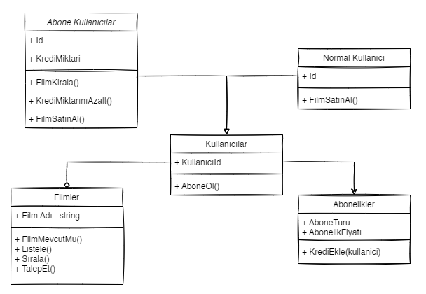

# Üniversite Yönetim Sistemi UML

- **Üniversiteye ait sınıflıklar, çalışma ofisleri ve departmanlar vardır**
- **Departmanlara ait ofisler vardır.**
- **Üniversiteye ait çalışanlar vardır. Bu çalışanlar profesör veya memur olabilir.**
- **Her çalışan bir ofiste çalışır.**

  

# Hayvanat Bahçesi Yönetimi UML

- **Hayvanlar hakkında depolanan bilgilerin çoğu tüm gruplamalar için aynıdır.**
- **Sistem ayrıca her hayvan için belirli ilaçların dozajını alabilmeli => getDosage () .**
- **Sistem Yem verme zamanlarını hesaplayabilmelidir => getFeedSchedule ().**
- **Sistemin bu işlevleri yerine getirme mantığı, her gruplama için farklı olacaktır. Örneğin, atlar için yem verme algoritması farklı olup, kaplanlar için farklı
olacaktır.**

  

# Havalimanı Yönetim UML

- **Havayolu şirketleri uçuşları gerçekleştirir. Her havayolunun bir kimliği vardır.**
- **Havayolu şirketi, farklı tipteki uçaklara sahiptir.**
- **Uçaklar çalışır veya onarım durumunda olabilir.**
- **Her uçuşun benzersiz kimliği, kalkacağı ve ineceği havaalanı, kalkış ve iniş saatleri vardır**
- **Her uçuşun bir pilotu ve yardımcı pilotu vardır ve uçağı kullanırlar.**
- **Havaalanlarının benzersiz kimlikleri ve isimleri vardır.**
- **Havaalanlarının benzersiz kimlikleri ve isimleri vardır.**
- **Havayolu şirketlerinin pilotları vardır ve her pilotun bir deneyim seviyesi mevcuttur.**
- **Bir uçak tipi, belirli sayıda pilota ihtiyaç duyabilir.**

  

# Online Film Sitesi 

- **Uygulamada filmler listenebilir, sıralanabilir ve kullanıcılar uygulamaya abone olabilir..**
- **Kullanıcılar abonelik için sistem üzerinden kredi satın alır.**
- **Sadece abone olan kullanıcılar, kredileri ile film kiralayabilir ve kiraladığı filmin kredi bedeli kadar hesabından düşülür.**
- **Normal kullanıcılar ve aboneler film satın alabilirler.**
- **Eğer film mevcut değilse ise talep edilebilir.**

  

# Asansör Simülasyonu

- **Kodluyoruz Sigorta Şirketi 12 katlı bir ofis binası inşa etmek ve onu en son asansör teknolojisi ile donatmak istiyor. Şirket, bina içindeki trafik akışı ihtiyaçlarını karşılayıp karşılamayacaklarını görmek için binanın asansörlerinin işlemlerini modelleyen bir yazılım simülatörü oluşturmanızı istiyor...**
- **Binada, her biri binanın 12 katına çıkabilecek beş asansör bulunacaktır. Her asansörün yaklaşık altı yetişkin yolcu kapasitesi vardır. Asansörler enerji tasarruflu olacak şekilde tasarlanmıştır, bu nedenle yalnızca gerektiğinde hareket ederler. Her asansörün kendi kapısı, kat gösterge ışığı ve kontrol paneli vardır. Kontrol panelinde hedef düğmeleri, kapı açma ve kapama düğmeleri ve bir acil durum sinyal düğmesi bulunur..**
- **Binadaki her katta, beş asansör boşluğunun her biri için bir kapı ve her kapı için bir varış zili vardır. Varış zili, asansörlerin bir kata vardığını gösterir. Her kapının üzerinde bulunan bir sinyal ışığı, asansörün gelişini ve asansörün hareket ettiği yönü gösterir. Her katta ayrıca üç set asansör çağrı düğmesi vardır.**
- **Bir kişi uygun çağrı düğmesine (yukarı veya aşağı) basarak bir asansörü çağırır. Bir programlayıcı, aramanın başladığı kata gitmek için beş asansörden birini görevlendirir. Asansöre girdikten sonra, bir yolcu tipik olarak bir veya daha fazla hedef düğmesine basar. Asansör kattan kata hareket ederken, asansörün içindeki bir gösterge ışığı yolcuları asansörün konumu hakkında bilgilendirir. Bir asansörün bir kata varması, dış asansör kapısının üzerindeki gösterge lambasının yakılması ve kat zilinin çalmasıyla belirtilir. Bir asansör bir katta durduğunda, her iki kapı grubu da önceden belirlenmiş bir süre boyunca otomatik olarak açılarak yolcuların asansöre girip çıkmalarına izin verir..**
- **ESimülatör, gerçek zaman geçişini simüle etmek ve simülasyonda meydana gelen olayları zaman damgası ve günlüğe kaydetmek için bir "saat" kullanır. Simülatör tarafından yolcu oluşturmak ve her yolcu için kalkış ve varış katlarını belirlemek için rastgele bir sayı üreteci kullanılır.**

  

